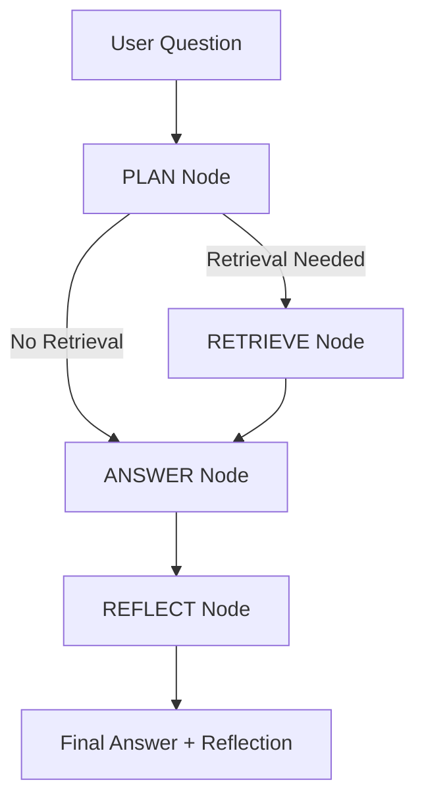

# 🤖 AI RAG Agent using LangGraph, Gemini 2.0, and ChromaDB

This project implements a Retrieval-Augmented Generation (RAG) system using **LangGraph**, **Gemini 2.0 Flash**, and **ChromaDB**. The agent answers questions based on a small local knowledge base of `.txt` files and includes evaluation components such as **LLM-as-a-Judge** and **ROUGE scoring** to assess answer quality.

---

## 🚀 Features

- **LangGraph Workflow:**Plan → Retrieve → Answer → Reflect
- **Gemini 2.0 Flash** for answer generation
- **ChromaDB** vector store for fast semantic retrieval
- **MiniLM Embeddings** for lightweight embedding generation
- **Evaluation Tools:**
  - LLM-as-a-Judge (Gemini)
  - ROUGE-1, ROUGE-2, ROUGE-L
- **Streamlit UI** included
- Clean, modular, interview-friendly structure

---

## 🧠 How the Agent Works

The agent follows a structured 4-node workflow orchestrated by **LangGraph**:

### 1. **Plan Node**

Determines whether retrieval is needed based on question keywords.

### 2. **Retrieve Node**

Fetches the most relevant text chunk from ChromaDB using MiniLM embeddings.

### 3. **Answer Node**

Uses Gemini 2.0 Flash to generate a grounded response using ONLY the retrieved context.

### 4. **Reflect Node**

Rates the answer (0–10) and provides a one-sentence explanation of its quality.

This ensures controlled generation, reduced hallucinations, and highly interpretable execution flow.

---

## 🛠️ Setup Instructions

### 1. Install Dependencies

```bash
pip install -r requirements.txt
```

### 2. Add API Keys (Important)

Set your Gemini API key:

```bash
export GEMINI_API_KEY="your_key_here"
```

(Optional) LangSmith:

```bash
export LANGSMITH_API_KEY="your_key_here"
```

### 3. Run Streamlit App

```bash
streamlit run app.py
```

---

## 📁 Folder Structure

```
project/
│── rag_agent.py               # Main RAG pipeline
│── evaluation.py              # LLM-as-Judge + ROUGE scoring
│── app.py                     # Streamlit UI
│── requirements.txt         
│── README.md                
│── data/                      # Knowledge base
│     ├── ai.txt
│     ├── data_science.txt
│     ├── deep_learning.txt
│     ├── machine_learning.txt
│     └── python_programming.txt
```

---

## 📊 Architecture Diagram (ASCII)

```
                 ┌──────────────┐
                 │   User QnA   │
                 └───────┬──────┘
                         │
                 ┌───────▼───────┐
                 │     PLAN      │
                 └───────┬───────┘
                 retrieve?│yes
                         │
                 ┌───────▼───────┐
                 │   RETRIEVE    │
                 └───────┬───────┘
                         │context
                 ┌───────▼───────┐
                 │    ANSWER     │
                 └───────┬───────┘
                         │
                 ┌───────▼───────┐
                 │    REFLECT    │
                 └───────┬───────┘
                         │
                 ┌───────▼──────-┐
                 │   Final Output│
                 └───────────────┘
```

---

## 🔵 Architecture Diagram

````markdown

````
